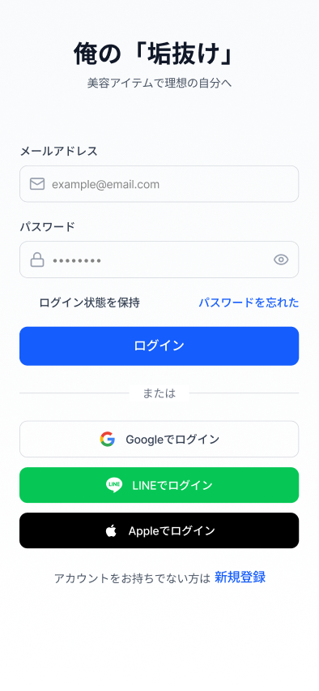
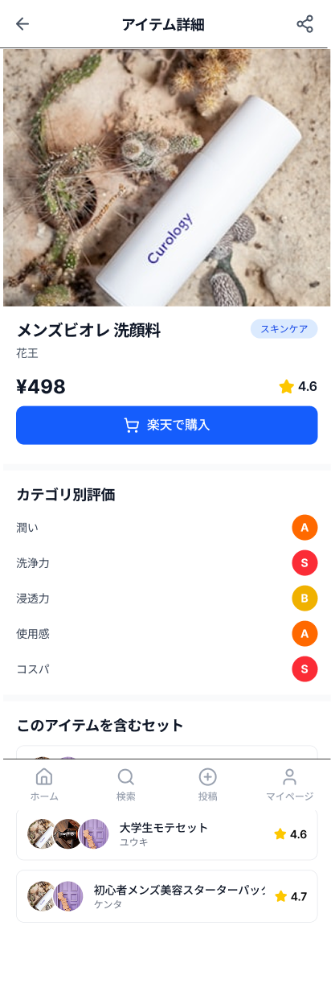
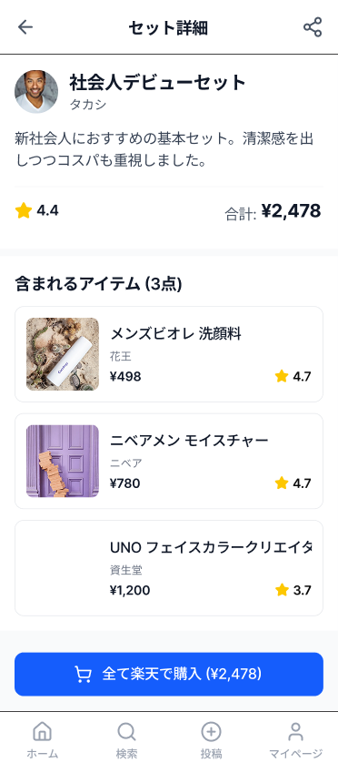
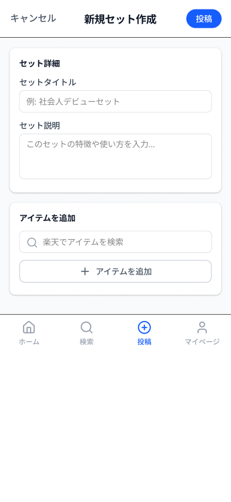
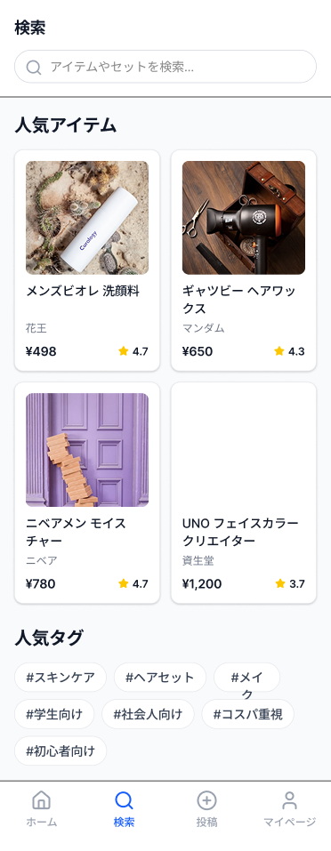
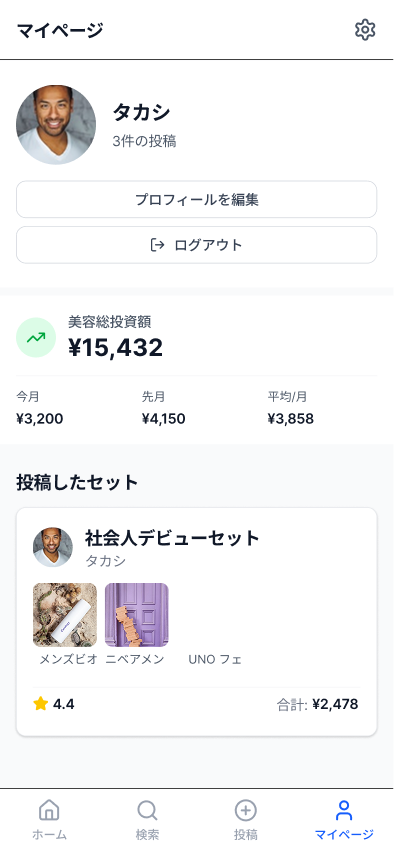
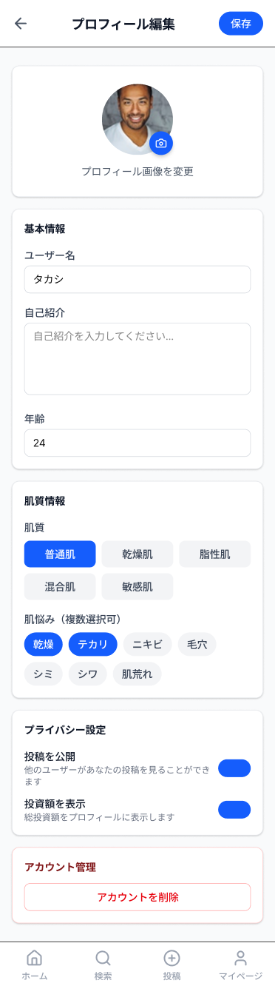

# men-s_items_review
 メンズ専用の美容アイテムのレビューサイトです。 
 「自分に合うメンズ美容アイテムが分からない」という男性に対し、同じ肌質や理想のロールモデルの「愛用セット」を提示することで、最適なアイテム選びを支援します。  
 商品のレビューだけでなく「セット（組み合わせ）」で投稿・閲覧できる仕組みを提供し、メンズ美容のリアルな活用法を可視化します。  
 レスポンシブ対応しているのでスマホからもご確認いただけます。
 
# URL
（実装予定）  
画面中部のゲストログインボタンから、メールアドレスとパスワードを入力せずにログインできます。

# 使用技術
- PHP 12.5.0
- Laravel 12
- PostgreSQL 18.1
- Node.js
- Docker/Docker-compose
- Rakuten Ichiba API

# プロトタイプ（画面設計図）
## プロトタイプ（画面設計図）

### 新規登録・ログイン画面

### ホーム画面

### アイテムの詳細画面

### セットの詳細画面

### 新規セットの投稿画面

### 検索画面

### マイページ

### プロフィール編集画面

# 機能一覧
- ユーザー登録、ログイン機能(devise)
- セット投稿機能（「俺の垢抜けセット」）
  - テーマ設定: 「仕事用・清潔感セット」「休日・美容男子セット」など、複数のアイテムをまとめたテーマ投稿
  - 個別評価（S〜D）: セット内の各アイテムに対し、カテゴリ別に固定された５項目のS〜D評価
  - 推奨肌質タグ: 各アイテムに「どの肌質の人に合うか」のタグを付与
  - 作成者コメント: セット全体のこだわりや使用感を記述
- 閲覧・検索機能
  - アイテム詳細ページ: 楽天から取得した正規情報の表示、全ユーザーの平均評価スコアを算出して表示
  - 検索: アイテム名、テーマ名、ユーザー名による部分一致検索
  - 楽天購入連携: 各アイテム詳細およびセット投稿一覧に、楽天市場の商品ページへ遷移するダイレクトボタンを設置
  - 肌質フィルタリング: 「自分と同じ肌質のユーザーの投稿」のみを抽出する機能
- 楽天API連携・アイテム管理
  - 商品検索: 楽天APIを利用し、キーワードから美容アイテムを検索・選択
  - データ自動取得: 商品名、画像、価格、商品URLを自動でDBに保存（投稿時）
  - カテゴリ分類: 投稿時に「ヘアセット」「スキンケア」「メイクアイテム」「ヘアケア」等を選択
  - 購入導線の提供: 取得したURLを活用し、ユーザーがワンタップで楽天市場の販売ページへ遷移できるボタンの実装

# テスト
- （予定）
